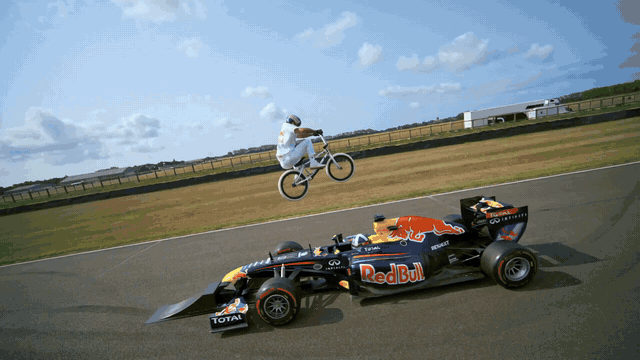
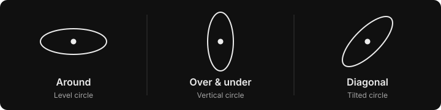
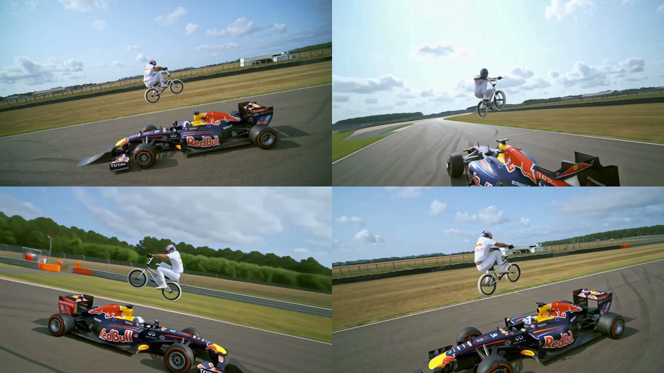

# 360° World Model Clips

Pick a frame from a video and move the camera around that moment. This app calls
Fal's H3 Max camera-controls model, then places the generated orbit between the
original action before and after your selection.



Six seconds from a previously saved 18-second edit. Source: Red Bull's
[Jumping Over A Moving F1 Car (world first)](https://www.youtube.com/watch?v=8o40mSS05iE&t=586).
The preview is reduced to 640 × 360; the app requested Fal's 1080P output.
[Example details and attribution](docs/assets/README.md).

[Run it locally](#run-it-locally) · [Setup and Docker](docs/setup.md) ·
[Exact prompt](orbit_preset.json) · [Camera path definitions](orbit_paths.py)

## Make your first edit

Open the app and connect your own Fal key in the main page. The key field starts
blank. Search for a YouTube video or paste its link, import it, then scrub to the
moment you want. The frame controls let you move forwards or backwards before
clicking **Use this frame**.

Choose **Around**, **Over & under** or **Diagonal**, then click **Generate** when
the frame is right. The finished edit appears in Outputs:

| Original action | Generated orbit | Original action resumes |
| --- | --- | --- |
| 4 seconds before your frame | 6 seconds around the frozen reference | Up to 10 seconds after your frame |

You get a 16:9 MP4 lasting up to 20 seconds. The continuation uses as much footage
as remains, up to ten seconds, and can be empty at the final source frame. During
the orbit, the source's own sound and music slow from 1x to 0.75x, then return to
normal. Speech and background noise stay in the mix; silent videos stay silent.
Download clips individually or combine finished clips of the same resolution
into a reel. Previous edits keep their original timing and audio.
Search, playback and choosing a frame do not submit a video generation request.

### Choose the camera path



**Around** requests a level loop around the reference. **Over & under**
requests a vertical loop, passing above and below the reference. **Diagonal**
requests a loop tilted 45 degrees from Around.

The diagram shows requested paths relative to the saved view. Fal still has to
generate the result. Over & under is experimental: it has no camera-roll control at its poles, so
the picture may flip there; Diagonal's keyframes approximate the tilted circle.
Review those new paths on your own frame. The F1 video above demonstrates Around.
Choosing a path alone does not start generation. To compare paths, choose another
one and rerun an existing output's saved frame. The new output records the path
you selected; the earlier edit stays available.

## How the H3 Max orbit works

The fixed prompt and original Around path live in
[orbit_preset.json](orbit_preset.json). [orbit_paths.py](orbit_paths.py) defines the
other camera choices from that preset.
The actual Fal endpoint is
[`minimax/h3-max/camera-controls`](https://fal.ai/models/minimax/h3-max/camera-controls),
which Fal names H3 Max Camera Controls / Multi Angle. The app uses that published
endpoint directly.

1. The importer keeps the highest available source streams and their resolution.
   If your browser needs another format, the app makes a separate preview. The
   original remains the source for frame extraction and export. Titles containing
   the whole word `football` also receive caption and audio-activity suggestions;
   other videos open in manual selection without that analysis.

2. **Use this frame** saves the selected source timestamp. Generation takes a
   copy of the exact source frame as a PNG and saves the request beside it. The
   moving video is used later for the edit; Fal receives the still image.

3. The server sends that image with the preset's fixed prompt and the selected
   camera keyframes. The prompt asks the scene to stay frozen while the camera
   moves. Around uses the original ten keyframes: it holds its starting angle
   for 0.2 seconds, eases around one full turn
   by 5.3 seconds, and holds the final angle for the remaining 0.7 seconds.
   Its elevation stays at zero. All three choices keep distance at one and use
   the same prompt, six-second duration and resolution. No assistant rewrites
   the request between runs.

4. Fal processes the queued request. The app shows progress, saves the provider's
   response and downloads the original generated video. It retains the complete
   returned timeline when adjusting the delivery to six seconds at 30 fps.
   The saved request ID lets recovery check the existing run without silently
   purchasing another generation.

5. A local edit inserts the saved PNG at the first and last orbit frames, with
   a direct cut and no added fade or hold. The app checks that those two decoded
   frames still match in the finished MP4.

6. FFmpeg joins four seconds of source, the orbit and up to ten seconds of source
   continuation. Every new edit loops the 1.75 seconds of audio just before the
   selected frame under the orbit. Speed and pitch ease from 1x to 0.75x, then
   back to 1x. Original picture and audio resume together on the next source
   frame. This local audio step makes no additional provider request.



These views come from the earlier 18-second F1 edit at 0, 1.5, 3 and 4.5 seconds
into its orbit. The existing preview assets retain that edit's timing.

### What to expect from the result

The preset requests six seconds, `1080P` output and `balanced` prompt expansion.
Fal may expand the submitted text before generation. Its
[schema](https://fal.ai/api/openapi/queue/openapi.json?endpoint_id=minimax/h3-max/camera-controls)
describes 1080P as latent refinement from a 768P source. For a 4K source, the app's
4K export keeps the original source and reference detail, then enlarges the
generated frames to fit.

The schema accepts one reference image and has no ending-image input. The matching
endpoints come from the local edit above. H3 can still change a rider's pose,
shift the background or return with different framing. A matching first and last
frame does not prove that the generated subject stayed frozen or that the
intervening camera move is physically accurate.

The slow audio treatment applies automatically to every new video. It retains
the complete source mix, including music and speech, and needs no crowd
separation or per-video setting. See [orbit audio](docs/setup.md#orbit-audio).

## Run it locally

You need Python 3.12, Node.js 22 or newer, and FFmpeg with FFprobe. On macOS:

```sh
brew install python@3.12 ffmpeg node
git clone https://github.com/ojslabs/360-world-model-clips.git
cd 360-world-model-clips
python3.12 bootstrap.py
.venv/bin/python server.py
```

Open <http://127.0.0.1:8476> and paste your own Fal key into **Your Fal account**.
Click **Connect Fal**. The server holds the key in memory for your browser session,
for up to eight hours. It is not saved to disk or preloaded into the page.
Disconnect to remove it; reconnect after a server restart. Fal usage is charged
to your account.

Use **View Fal usage** in the account panel to open your
[Fal usage dashboard](https://fal.ai/dashboard/usage-billing).

Bootstrap installs the pinned Python dependencies, checks the media tools,
downloads the verified speech model and builds the interface. See
[setup](docs/setup.md) for Linux, Docker and shared-host configuration.

## Optional live Day/Night preview

Step 4 connects a finished clip to Reactor X2. Start the live preview and switch
Day or Night while the same session streams edited frames back to the player.
It stops after five minutes, or when you click Stop. The optional source audio is
not synchronized to the delayed picture. Saved file remixes are also available
under **Saved remixes**.

Reactor needs its own server-side key and credits. It is separate from the Fal
orbit generation and keeps your original finished clips. See
[Reactor setup](docs/setup.md#optional-reactor-remixes).

If you find this useful, star the repository. Examples, bug reports and small
pull requests are welcome, especially clips that expose a bad camera return.
Keep credentials and private recordings out of issues.

The code is [MIT licensed](LICENSE). The F1 demonstration uses third-party footage;
its rights are separate from the code license. See the
[example attribution](docs/assets/README.md) and [third-party notices](THIRD_PARTY_NOTICES.md).
