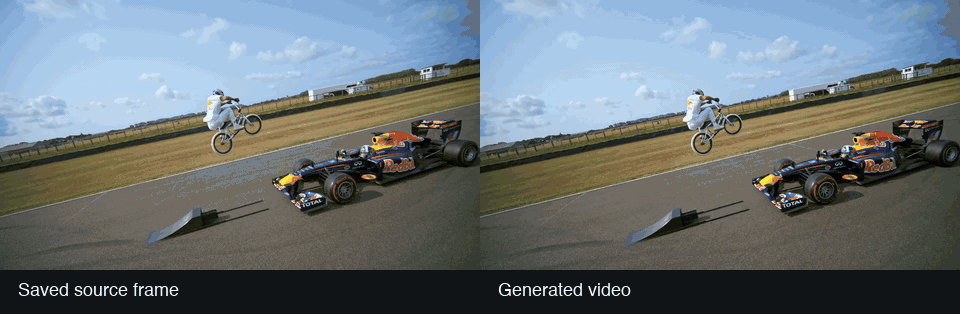
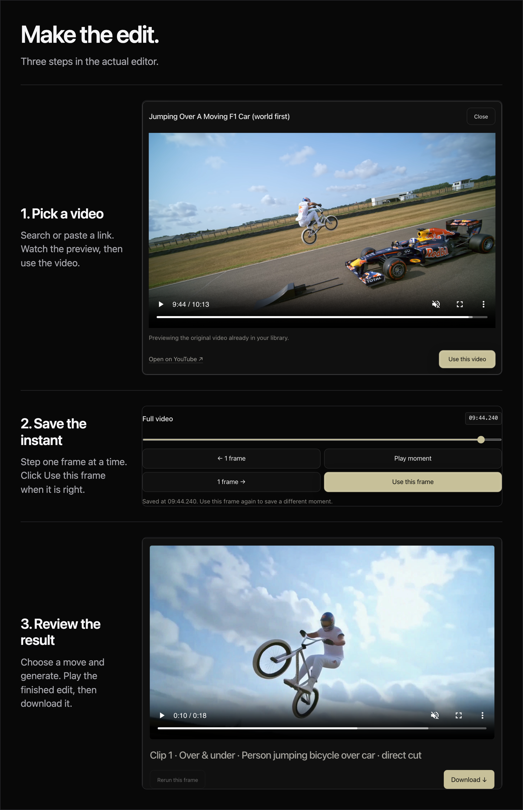

# 360° World Model Clips

Turn a moment from a video into a camera orbit, then return to the original action.
Choose a frame, choose a path and download the finished edit.


One saved frame, then a generated view from below. This **Over & under** example
uses 1080P generation. [Source and attribution](docs/assets/README.md).

<details>
<summary>Watch the generated movement (6.58 seconds)</summary>



The left image stays on the source frame. The right shows the returned generation,
including its changes to the subject and scene.

</details>

**[Quick start](#quick-start)** · [How it works](docs/how-it-works.md) ·
[Setup](docs/setup.md) · [Download source ZIP](https://github.com/ojslabs/360-world-model-clips/archive/refs/heads/main.zip) ·
[MIT license](LICENSE)

## Quick start

Install and start **[Docker Desktop on macOS](https://docs.docker.com/desktop/setup/install/mac-install/)**
or **[Docker Engine on Linux](https://docs.docker.com/engine/install/)** first.
With Docker running, paste this into Bash:

```sh
curl -fsSL \
  https://github.com/ojslabs/360-world-model-clips/raw/main/scripts/install.sh | bash
```

The installer downloads the app and builds its Python 3.12, Node.js, FFmpeg and
speech-model environment inside Docker. The first launch can take several minutes.
[Read the installer](scripts/install.sh) · [Setup and native ZIP option](docs/setup.md)

When ready, it prints **<http://localhost:8476>** and an **access code**. Open that
address, sign in with the code, then paste your own key into **Your Fal account**
and click **Connect Fal**. Generation uses your paid Fal account; optional Reactor
remixes use a separate account. No provider credits are included.

Keys stay in server memory for your browser connection, for up to eight hours.
Disconnect, expiry or a restart clears the connection.
[Credentials and privacy](docs/setup.md#credentials).

## Make an edit



1. Search or paste a YouTube link, preview it, then click **Use this video**.
2. Scrub to your moment, step forwards or backwards, then click **Use this frame**.
3. Choose a path, generate, then review and **Download** the result.

The output shown is an earlier 18-second F1 edit. New edits use:

| Before | Orbit | After |
| --- | --- | --- |
| 4 seconds of source | 6 seconds generated | Up to 10 seconds of source |

The 16:9 MP4 lasts up to 20 seconds. The source's own music, speech and background
sound slow to 0.75x during the orbit and return to normal afterwards. Silent
videos stay silent. Download individual clips or combine finished clips of the
same resolution into a reel. Earlier edits remain available.

## Choose a path


**Around** is a level loop. **Over & under** requests a vertical loop.
**Diagonal** requests a loop tilted 45 degrees. These paths are relative to the
saved view. Over & under is experimental and may flip at the top or bottom;
Diagonal approximates its tilted circle with keyframes.
[Path details and the fixed prompt](docs/how-it-works.md#camera-paths).

Generation requests Fal's highest supported **1080P** setting. A **4K export**
preserves the source and reference resolution and enlarges the generated orbit.
The first and last orbit frames are matched locally. Subjects can still move
within the generated scene; matching endpoints do not prove a frozen scene or
an accurate full turn. [Result limits](docs/how-it-works.md#result-limits).

## Optional Reactor remixes

Connect your own key in **Your Reactor account** to try a live Day/Night preview
or save a separate remix of a finished clip. Live toggles use the same session;
**Stop** ends it, with a five-minute limit. Original edits remain unchanged.
[Reactor setup and limits](docs/setup.md#optional-reactor-remixes).

## Repository

| Folder | Contents |
| --- | --- |
| [app/](app/) | Python service, provider adapters and video processing |
| [ui/](ui/) | Browser interface and bundled live client |
| [config/](config/) | Shared generation preset |
| [scripts/](scripts/) | Build, setup and maintenance tools |
| [tests/](tests/) | Python and JavaScript checks |
| [docs/](docs/) | Setup, workflow and example attribution |
| [vendor/](vendor/) | Included report-kit assets and licenses |

[How it works](docs/how-it-works.md) · [Development and checks](docs/setup.md#checks) ·
[Contributing](CONTRIBUTING.md) · [Third-party notices](THIRD_PARTY_NOTICES.md)

The code is MIT licensed. Rights to the [F1 example footage](docs/assets/README.md)
are separate. Keep credentials and private recordings out of issues.
