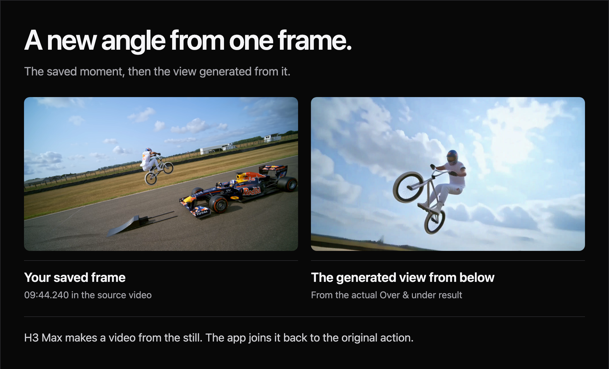

# How an edit is made

[360° World Model Clips](../README.md) sends a saved video frame to Fal's
[`minimax/h3-max/camera-controls`](https://fal.ai/models/minimax/h3-max/camera-controls)
endpoint, then places the generated orbit between the original action before
and after that moment. Fal names the endpoint H3 Max Camera Controls / Multi Angle.

The moving source video stays available for the final edit. The generation
request contains a still image, the fixed prompt and the selected camera path.

## From source to saved frame

Search for a YouTube video or paste its link. Preview the result before importing,
then scrub in the app and use the frame-step controls to move forwards or
backwards. **Use this frame** saves the selected source timestamp.

The importer selects the highest available source streams and retains their
resolution. When the browser needs another format, the app creates a separate
playback preview. Frame extraction and export continue to use the original.

Titles containing the whole word `football`, ignoring case, also receive
suggestions from captions and audio activity. Other titles open in manual
selection without that analysis. Loud audio is a detection signal, not proof
that a crowd is reacting to a particular action.

Generation copies the exact selected frame into an immutable PNG and saves its
request beside it. Editing the source selection later cannot change that run's
reference. Searching, playback and choosing a frame do not submit a video
generation request. Optional visual action labels use a separate paid Fal call.

## Camera paths

[config/orbit_preset.json](../config/orbit_preset.json) owns the fixed prompt,
endpoint, resolution, duration and original Around path.
[app/orbit_paths.py](../app/orbit_paths.py) derives the other choices.

| Choice | Requested positions |
| --- | --- |
| Around | A level loop with elevation zero |
| Over & under | A vertical loop passing above and below the reference |
| Diagonal | A loop tilted 45 degrees from Around |

Around retains the original ten keyframes: hold at the starting angle for
0.2 seconds, ease through one full turn by 5.3 seconds, then hold the ending
angle for 0.7 seconds. All three paths keep distance at one and share the same
fixed prompt, six-second duration, `1080P` resolution and `balanced` expansion.
No assistant rewrites the submitted prompt between runs. Fal may expand that
text internally before generation.

The diagram shows requested positions relative to the saved view. It does not
infer the subject's direction of motion. Over & under is experimental: its
azimuth changes at the poles, where the API has no roll or up-vector control to
guarantee orientation. The picture may flip. Diagonal uses points on a tilted
circle; interpolation between the points can deviate from that circle.

Choosing a path alone does not start generation. To compare moves, choose a
path and rerun an existing output's saved frame. That creates a separate paid
request with the new choice, while the earlier edit stays available. Recovery
of an interrupted request retains its saved frame, prompt and path.

## Generation and assembly

The app submits the still image and selected parameters, then shows the queued
request's progress. When Fal completes, it saves the response and downloads the
original generated video. The native provider file stays intact. Delivery uses
the full returned timeline, retimed uniformly to six seconds at 30 fps.

The saved request ID lets recovery check the existing generation without buying
a replacement. An ambiguous submission, download problem or local edit failure
does not automatically purchase another generation. Browser-origin recovery
requires the same connected key.

A local edit inserts the saved PNG at the first and last orbit frames. It uses
a direct cut, without an added fade or hold, and checks that these two decoded
frames still match in the finished MP4. The provider receives one reference
image; this local edit is separate from its generation.

FFmpeg assembles the result:

| Original action | Generated orbit | Original action resumes |
| --- | --- | --- |
| 4 seconds before the selected frame | 6 seconds | Up to 10 seconds after the selected frame |

Choose a frame with the full four-second lead available. Continuation starts on
the next original source frame and uses the remaining footage, up to ten seconds.
It can be empty at the final source frame. The result is a 16:9 MP4 lasting up to
20 seconds. Original picture and audio resume together.

Outputs provides the completed edits for review and individual download. Clips
of the same resolution can also be combined into a reel. Previous edits retain
their saved timing, media and audio treatment.

## Source audio

Every new edit loops the 1.75 seconds of audio immediately before the saved frame
under its orbit. Speed and pitch ease from 1x to 0.75x, then return to 1x. Music,
speech and background noise stay together in the source mix.

The local bed overlaps the orbit's audio boundaries for smooth joins; it does
not extend the six-second picture. Original audio stays synchronized before
and after the orbit. Genuine silence and missing audio remain silent. Probe or
decode failures are reported instead of being replaced with silence.

This step uses local processing, with no crowd separation, borrowed atmosphere,
per-video override or additional provider request. Generated model audio is
discarded. [Audio timing and setup](setup.md#orbit-audio).

## Result limits

The preset requests Fal's highest supported `1080P` output. The endpoint's
[OpenAPI schema](https://fal.ai/api/openapi/queue/openapi.json?endpoint_id=minimax/h3-max/camera-controls)
describes it as latent refinement from a 768P generation. The app retains the
provider's native file and records its dimensions separately from delivery.

For a 4K source, a 4K export keeps the source and reference detail while enlarging
the generated 1080P frames to fit. This is not native 4K generation.

The schema accepts one image and has no ending-image input. Matching first and
last orbit frames comes from the local reference edit. H3 can still change a
rider's pose, shift the background or return with different framing. Endpoint
equality does not prove that the generated subject stayed frozen or that its
camera motion was physically accurate. Review each result, including the cuts
back into the source.

This **Over & under** example starts from the source frame at **584.24 seconds
(9:44.24)**. The generated still is 3.25 seconds into the native response. It shows
a low-angle view of the bicycle against the sky, a viewpoint absent from the
reference. The native video has 158 frames at 1920 × 1080 and 24 fps, lasting
6.583333 seconds. [Watch the side-by-side motion](assets/f1-over-under.gif).

The corresponding saved edit lasts 18 seconds: 8 seconds of source, 6 seconds
of retimed generation and 4 seconds of source continuation. It retains that
historical timing. The current four-second lead and up-to-ten-second tail apply
to new edits. This example does not verify every requested path or guarantee
that the subject remains frozen during generation.

Source: Red Bull's [Jumping Over A Moving F1 Car (world first)](https://www.youtube.com/watch?v=8o40mSS05iE&t=584).
[Example details and attribution](assets/README.md).

## Accounts and optional remixes

Connect your own Fal key in the main page. Fal charges generation and visual
label requests to that account. The server holds the key only in memory for
your browser connection, for up to eight hours. Disconnect, expiry or restart
clears it. Work already submitted retains its captured credential; reconnect
the same key to recover an acknowledged interrupted generation. The page's
**View usage & billing** link opens the [Fal dashboard](https://fal.ai/dashboard/usage-billing).

A separate **Your Reactor account** connection enables optional X2 live previews
and saved remixes, charged to your Reactor account. Connecting checks access
without starting a model session. The key has the same temporary storage policy;
it does not replace the Fal connection.

In Step 4, choose a finished clip and start a live preview. Day/Night changes
update the prompt within that same session. Stop terminates it, and the server
caps its duration at five minutes. Optional source audio is not synchronized
to the delayed Reactor picture.

**Saved remixes** creates a separate X2 video and retains the original clip and
its audio. X2 runs at its own native resolution. Its generated action and
framing can change, and equal duration does not prove exact source-frame
alignment. Inspect the saved result before use.

[Installation, credentials, Docker and development](setup.md) cover the full
setup. The code is [MIT licensed](../LICENSE); provider accounts and rights to
source footage are separate. See [third-party notices](../THIRD_PARTY_NOTICES.md).
